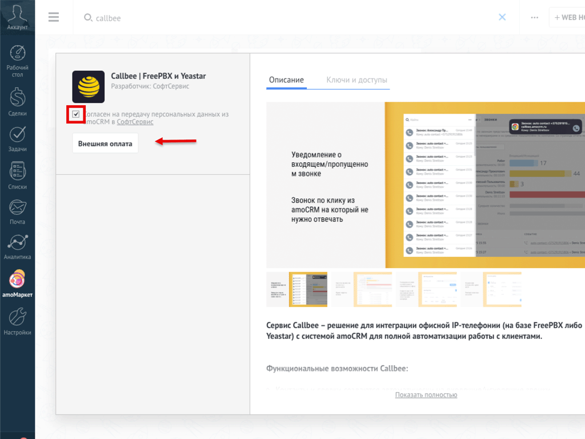

# FreePBX 13+ и amoCRM
> [!CAUTION] ВАЖНО!
> Внимательно прочитайте и выполните каждый пункт руководства, чтобы правильно настроить интеграцию Callbee.

> [!NOTE] Необходимые требования
>*   FreePBX версии 13 и выше
>*   Активированный chan_sip драйвер и транки настроенные с его использованием
>*   Статический IP-адрес
>*   Личный кабинет Callbee.
>*   Активная лицензия amoCRM.
>*   Доступ к TCP порту 5038 сервиса AMI Asterisk с разрешенных адресов сервиса.
>*   Доступ пользователей к записям разговоров по HTTP/HTTPS.

---
## Видеоинструкция
https://www.youtube.com/watch?v=dQw4w9WgXcQ

---
## 1. Установка виджета Callbee | FreePBX и Yeastar в amoCRM
*  Находим Виджет **Callbee | FreePBX и Yeastar** в **amoМаркет**.
    
*  Устанавливаем Виджет, подтвердив согласие с **Политикой обработки персональных данных** и нажав кнопку **"Внешняя оплата"**.
    
*  После успешной установки виджета нажмаем кнопку **"Сохранить"**.
    

!!!success Поздравляем!
Вы установили Виджет Callbee | FreePBX и Yeastar.
!!!

**Поздравляем!** Вы установили приложение Callbee | FreePBX и Yeastar.
## 2. Настраиваем подключение сервиса к IP-АТС FreePBX 13+
> [!CAUTION] ВАЖНО!
> Успех интеграции напрямую зависит от правильной настройки соединения с сервисом и AMI IP-АТС FreePBX 13+. Сотрудники должны иметь возможность скачать запись разговора по ссылке с валидными SSL-сертификатом с сервера телефонии. 

Шаги для активации и настройки Asterisk Manager Interface (AMI):

- Откройте файл **/etc/asterisk/manager.conf** с помощью текстового редактора (например, **vi**, **nano**).
-  В секции **general** найдите строку **bindaddr**. Измените ее значение на **0.0.0.0**.
    ```
        [general]
        enabled = yes
        port = 5038
        bindaddr = 0.0.0.0
        displayconnects=no ;only effects 1.6+
    ```
-  Сохраните внесенные изменения в файле **/etc/asterisk/manager.conf**. Закройте текстовый редактор.
-  Откройте файл **/etc/asterisk/manager_custom.conf** с помощью текстового редактора (например, **vi**, **nano**).
-  Добавьте следующую структуру в конец файла:
    ```
        [callbee]
        secret=СЛОЖНЫЙ_ПАРОЛЬ
        deny=0.0.0.0/0.0.0.0
        permit=127.0.0.1/255.255.255.0 #
        permit=185.255.77.197/255.255.255.255
        permit=77.105.155.20/255.255.255.255
        permit=31.44.1.160/255.255.255.255
        permit=178.123.180.59/255.255.255.255
        read=system,call,log,verbose,command,agent,user,config,command,dtmf,reporting,cdr,dialplan,originate,message,writetimeout = 500
    ```
-  Сохраните внесенные изменения в файле **/etc/asterisk/manager_custom.conf**. Закройте текстовый редактор.
-  Выполните команду **asterisk -rx "manager reload"** в командной строке (bash) для **перезагрузки сервиса AMI Asterisk**:
> [!CAUTION] ВАЖНО!
> Порт 5038 должен быть открытым для IP-адресов сервиса Callbee.

## 3. Публикация записи разговора

Публикация записей разговоров по HTTP    
-  Установите docker на ваш сервер https://github.com/docker/docker-install
-  Запустите отдельный веб-сервер nginx с записями разговоров и голосовой почты. Это позволит безопасно дать доступ вашему порталу Битрикс24 к записями раговоров.
```
docker run -it -d \
--name recs_nginx \
--restart=unless-stopped \
-v /var/spool/asterisk/monitor:/usr/share/nginx/html/monitor:ro \
-v /var/spool/asterisk/voicemail:/usr/share/nginx/html/voicemail:ro \
-p 50381:80 \
nginx
```
-  Проверьте статус контейнера командой docker ps. Контейнер с именем recs_nginx должен быть в состоянии Up.

Публикация записей разговоров по HTTPS с валидным SSL-сертификатом
> [!CAUTION] ВАЖНО!

**Поздравляем!** Вы создали и запустили сервис  Callbee.